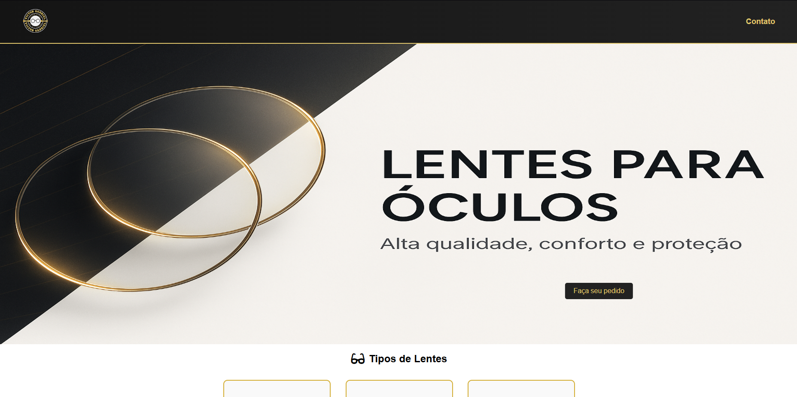
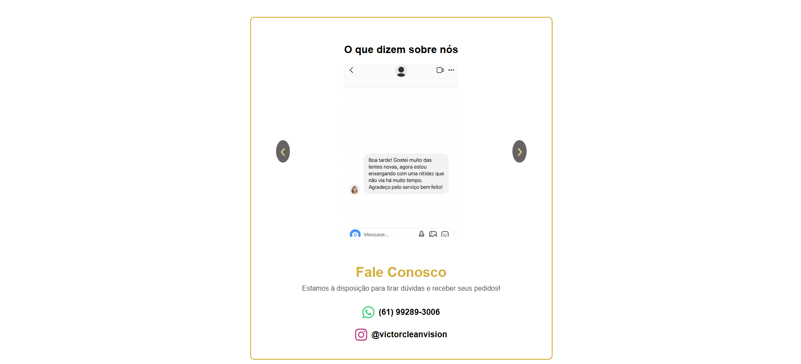

# Victor Clean Vision 👓✨

Este é o site oficial da ótica **Victor Clean Vision**, desenvolvido para apresentar os tipos de lentes oferecidos, possibilitar pedidos rápidos via WhatsApp e destacar os diferenciais da loja — como a **entrega no mesmo dia**.

## 🌐 Link do site
[🔗 Acesse o site aqui](https://joaoromao17.github.io/victor_clear_vision/)  

## 🖼️ Prévia

### Página Inicial

### Tipos de Lentes

### Feedbacks de Clientes

## 🔗 Funcionalidades
- Página inicial com destaques e informações gerais
- Explicações detalhadas sobre cada tipo de lente:
  - Monofocais
  - Bifocais
  - Multifocais
- Galeria com **feedbacks reais de clientes**
- Página de pedido com integração direta com o WhatsApp
- Página de contato com links diretos para WhatsApp e Instagram

## 💻 Tecnologias Utilizadas
- HTML5
- CSS3
- JavaScript (puro)
- Font Awesome (ícones)
- Responsivo para mobile e desktop

## 🧠 Estrutura de Pastas
/Victor_clear_vision
│── index.html  (Página inicial) 
│── README.md
├── /imagens  (Pasta com todas as imagens)
│   ├── banner.png 
│   ├── favicon_victor_clean.ico 
│   ├── FIltro_azul.png 
│   ├── Lente_Bifocal.png 
│   ├── Lentes_Multifocais.png
│   ├── Lentes_Monofocais.png
│   ├── logo.png
│   ├── oculos_com_lente_bifocal.png
│   ├── oculos_com_lente_monofocal.png
│   ├── oculos_com_lente_multifocal.png
│   ├── /feedbacks (pasta com prints de feedback)
│   ├── ├── /feedback1.jpg
│   ├── ├── /feedback2.jpg
│   ├── ├── /feedback3.jpg
│   ├── ├── /feedback4.jpg
│   ├── /Previa (pasta com a previa do site)
│   ├── ├── /Feedbacks.png
│   ├── ├── /Pagina_inicial.png
│   ├── ├── /Tipos_de_lentes.png
├── /style  (Pasta com css)
│   ├── styles.css 
├── /script (Pasta com js)
│   ├── script.js 
├── /lentes  (Pasta com as páginas tipos de Lentes) 
│   ├── bifocais.html
│   ├── monofocais.html
│   ├── multifocais.html 
├── /loja  (Pasta para pedido) 
│   ├──pedido.html  
└── /contato  (Pasta página de Contato) 
    ├── contato.html 

## 📦 Como rodar localmente
1. Baixe o repositório:
git clone https://github.com/joaoromao17/victor_clear_vision.git
2. Abra a pasta no seu editor de código.
3. Clique duas vezes no `index.html` para abrir no navegador (ou use o Live Server).
4. Navegue pelo site normalmente como se estivesse online.

## 🧑‍💻 Desenvolvedor
- **João Vítor Romão Colares de França**
- Tecnólogo em Análise e Desenvolvimento de Sistemas
- [LinkedIn](https://www.linkedin.com/in/joão-vítor-romão-colares-de-frança-100257264/)

---
